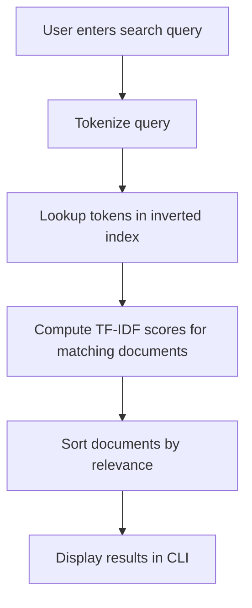

````markdown
# Mini Search Engine


A **C++ project** that searches and ranks text files using data structures and algorithms.  
It builds an **inverted index** to store words and their document locations and uses the **TF-IDF** method to rank and display the most relevant results for a user’s query.

---

## 📑 Table of Contents

- [Features](#-features)  
- [Installation](#-installation)  
- [Usage](#-usage)  
- [How It Works](#-how-it-works)  
- [Directory Structure](#-directory-structure)  
- [Screenshots](#-screenshots)  
- [Author](#-author)  
- [License](#-license)  

---

## 📝 Features

- Builds an **inverted index** from a collection of text files.  
- Implements **TF-IDF ranking** to display relevant results.  
- Efficient search for large sets of documents.  
- Handles multiple queries interactively.  
- Written entirely in **C++**, using custom data structures.  

---

## 💻 Installation

1. **Clone the repository:**
   ```bash
   git clone https://github.com/YourUsername/mini-search-engine.git
   cd mini-search-engine
````

2. **Build the project using g++:**

   ```bash
   g++ -std=c++17 -o searchengine main.cpp
   ```

3. **Or using Makefile:**

   ```bash
   make
   ```

---

## 🚀 Usage

1. Run the executable:

   ```bash
   ./searchengine
   ```

2. Enter the folder path containing your documents when prompted.

3. Type search queries to find relevant documents or `exit` to quit.

**Example:**

```
Enter folder path: C:\Users\Ryuk\Documents\dsa
Index built: 27 documents processed.

Enter search query (type 'exit' to quit): lab
Search results:
1) DocID: 13 Name: Lab-1 done.docx Score: 0.219921
```

---

## 🧠 How It Works

### Indexing Workflow

```mermaid
flowchart TD
    A[User enters folder path] --> B[Read all supported files]
    B --> C[Tokenize content and filenames]
    C --> D[Build inverted index (token → posting list)]
    D --> E[Calculate document lengths and TF-IDF stats]
    E --> F[Index ready for search queries]
```

### Search Workflow



---

## 📁 Directory Structure

```
/src       -> C++ source files (.cpp, .h)
/tests     -> Sample input documents and expected outputs
/docs      -> Project report, figures, diagrams
README.md  -> This file
Makefile or CMakeLists.txt -> Build automation
```

---

## 🖼️ Screenshots

**Example Run:**

```text
Enter folder path: C:\Users\Ryuk\OneDrive\Desktop\dsa
Index built: 27 documents processed.

Enter search query (type 'exit' to quit): lab
Search results:
1) DocID: 13 Name: Lab-1 done.docx Score: 0.219921

Enter search query (type 'exit' to quit): linked
Search results:
1) DocID: 1 Name: doublylinkedlist.cpp Score: 0.0058471
2) DocID: 25 Name: tempCodeRunnerFile.cpp Score: 0.0058471

Enter search query (type 'exit' to quit): information
No files found for query: information

Enter search query (type 'exit' to quit): I
Search results:
1) DocID: 22 Name: lab6task.cpp Score: 0.0470785
2) DocID: 1 Name: doublylinkedlist.cpp Score: 0.030564
3) DocID: 25 Name: tempCodeRunnerFile.cpp Score: 0.030564


---

## 🛠️ Technologies Used

* C++17
* Custom data structures (`MyVector`, `HashMapStringToPtr`)
* TF-IDF ranking algorithm
* Command-line interface (CLI)

---

## 👤 Author

**Abdullah Khan & Hafsa Malik**

---

## 📄 License

This project is licensed under the **MIT License**.

```
